## CSE 5544 Final Project

Authors: 
Dantong Xue (xue.425), Alex Shearer (shearer.145), Pouya Kousha (kousha.2)

### Introduction

Recent advances in High Performance Computing (HPC) have provided the fast processing engine for HPC applications.
Designing a monitoring and profiling visualization tool for network
analysis is a challenging task. 
Newer set of challenges come out as High Performance Computing (HPC) systems become more complex and users need better visualization capabilities for **detailed network communication traffic** . A breakdown of traffic is required to understand the application behavior in terms of communication while not loosing general view of network traffic. Such visualization capability is currently missing or not studied well.  

We use the data gathered by OSU INAM - a network monitoring tool that gathers, stores profiling data for Infiniband network. By having the data we investigate visualization techniques to demonstrate the data in a more efficient, easy to interpret and holistic manner. Such visualization designs will help the users and the management team to understand the underlying structure of the network and resource utilization for the nodes in the system.

There is a need for interactive and straightforward visualization tool to better utilize and arrange the communication details happening on the network. The idea of this project is to give a clear visualization how the HPC infrastructure perform and how individual nodes in that network communicate with each other.
### Understanding the Data

The data is obtained from storage units of OSU INAM\cite{inamdownload}. A SQL dump is performed with useful tables exported as csv files. The data is provided by Pouya Kousha (one of our teammates) under the approval of his supervisor. For the network topology three types of tables are provided: Links, nodes. The nodes table consist of type of the nodes (compute node or switch), Global Unique IDentifier (GUID), Local IDentifier (LID), node name, and number of ports. The links table include information on source and destination (GUID, port) pair, type of the link depending on being switch<->switch link or node<->switch, link width, and link speed. For the network traffic we have port data counters table. In this table we show the network traffic for every link in the network. Since the information from both endpoints of link are the same, the data only gathers the counters from switch endpoints and leaving the nodes uncollected to optimize the data collection speed. The table includes the switch GUID, the port number, transmitted data (xmit\_data), received data (rcv\_data), number of sent/received packets, uni-cast sent/received data, multi-cast sent/received data, and time the entry was added on. The data consist of 3557 entire sweep of the entire network of 60 nodes. 

### Problem Statement

* How can the network topology be visualized along with link usage in an easy-to-interpret manner?
* Can we visualize the details of network topology like connectivity and show link usage?
* How can we present the network traffic of links in an interactive manner without compressing the data points?

### Visualizations

With this in mind, we provide a suite of visualizations to meet the clients' need for understanding the HPC network.

#### Timeseries Performance Plots

For network monitoring, having historical performance metrics visualized is also important. Clients may want to have analysis to historical data to find the **abnormal / extreme** points along the timeline.

We hear from our clients and implement the timeseries performance plots. The plots give information about sending/receiving package number and bits for a certain node in a period of time. Clients can easily drag the timeline to limit the timeframe shown on the plot.

Clients will first use the overall view to identify the abnormal point.

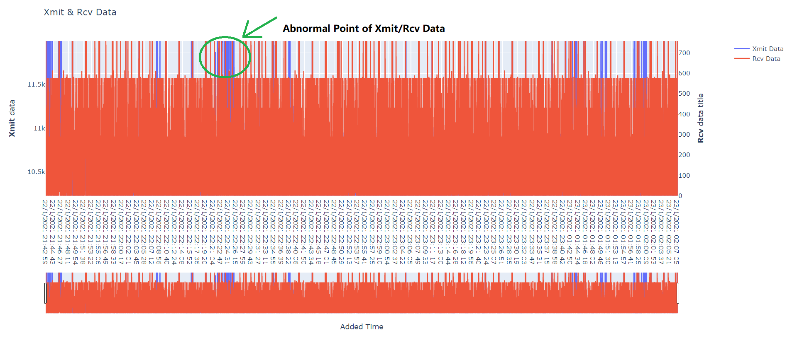

Then, the client can zoom in to check detailed numbers for that region.

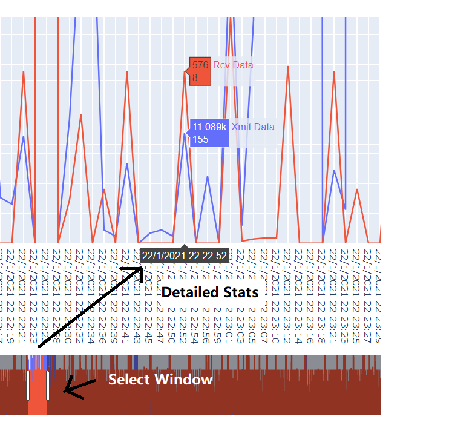

The interactive version of the timeseries performance plot can be accessed [here](data_line_plot.html).

#### Network
We started by visualizing the topological structure of all our computing nodes. The plot simply shows the connections between nodes with color indicating the node types (red->switches, white->normal nodes).

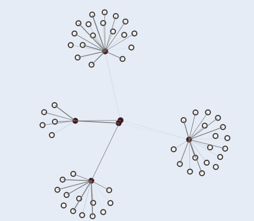

As we move forward, we see the need of monitoring link usage visually. We add link color as the indicator for link usage. We intentionally choose hue instead of luminance to show different usage of the network as we think hue does a better job in categorizing the link usage circumstances.

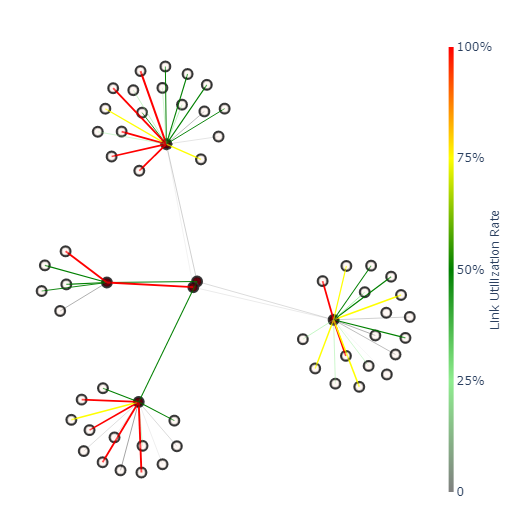

 To compensate the need of accurate link usage data, we provided hovering to show the utilization number.

 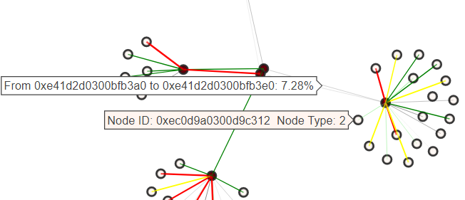

#### Radar Plot

In order to show more detailed information about the node that we care, we implemented radar chart on top of the network design.

The initial design comes as a zoomed radar chart beside the network structure, as shown below.

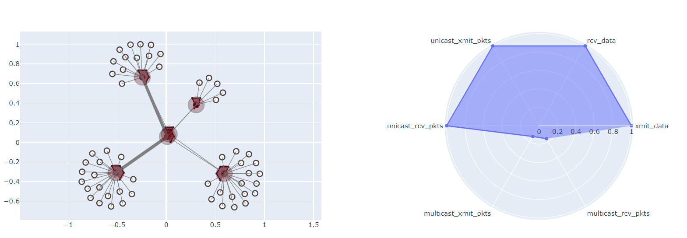

We further improve this design by intergrating the radar plot directly to the network topology, as we believe the integration can help our clients to compare metrics between two nearby switches.

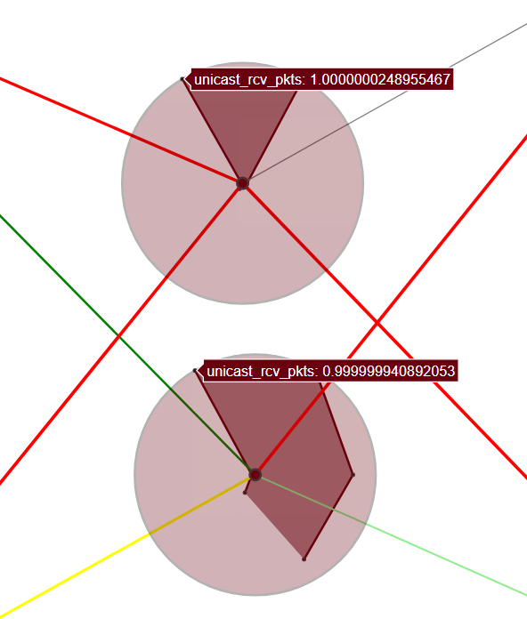

#### Integration

With all the elements above, we have a fully integrated suite of both network structure, link utilization rate, and detailed performance numbers for each node realized by integrating the radar plot with the network graph.

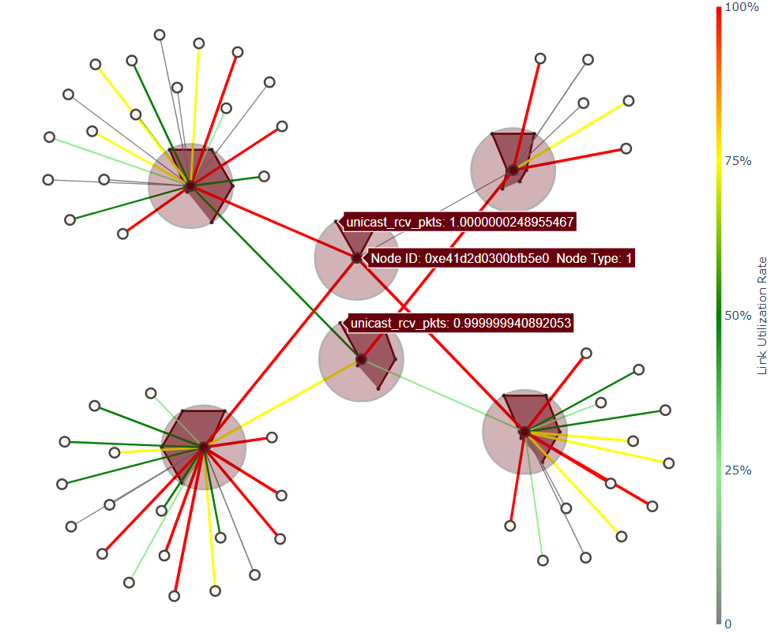

The interactive version of the network can be accessed down below.

[NetworkMulti](radar_network_multi.html)
[NetworkSingle](radar_network.html)

#### Scalability

We add 30x more nodes and 20x more links to assess the scalability of our design. The results are as follow:

In single link setting, the network can perform reasonably.

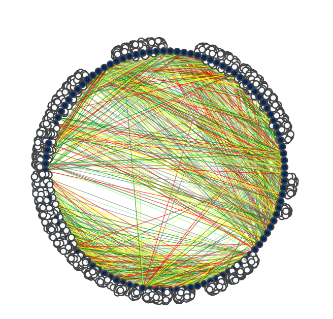

After zooming in, we can still get very clear information about nodes and edges in our network, especially the information relevant to a particular switch node.

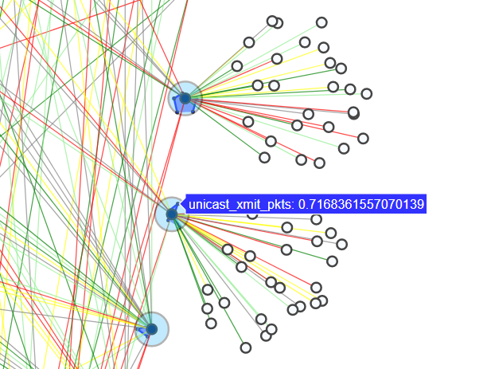

For multi link setting, the readability of the overall network compromises.

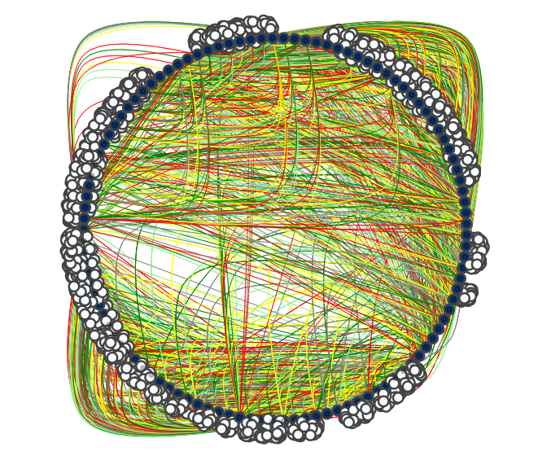

After zooming in, we can see information about the nodes. But the information for links are harder to comprehend.

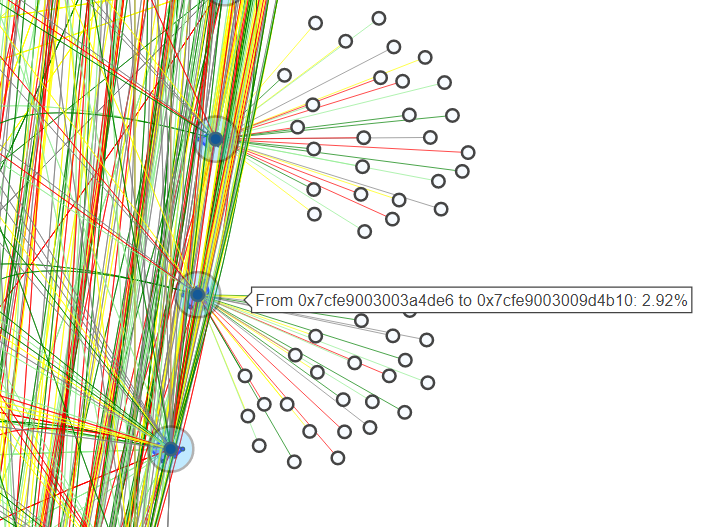

As a result, we would suggest that the clients use several subplots for different components of the network for the best performance.

Please check the interactive version down below.

[LargeNetworkMulti](radar_network_multi_scale.html)
[LargeNetworkSingle](radar_network_scale.html)

